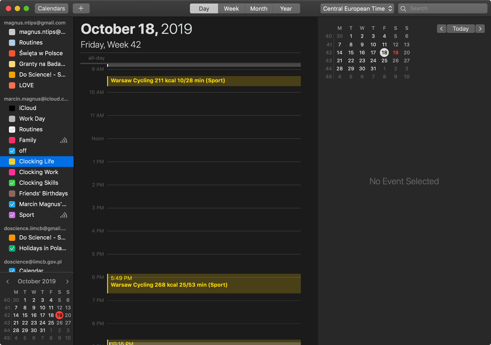

# Send your Garmin activities to Calendar

**Figure**. See your activities in your Calendar: what activity, kcal, duration of moving, duration (Sport). 

**This approach uses a hacky way to send events to Apple Calendar, so it works only on macOS**.

First get this script [garminexport](https://github.com/petergardfjall/garminexport) and download activities:

    garminexport$ git:(master) ✗ ./garminbackup.py mag_dex@o2.pl --password XXXXXXXXXXXXXXXXXXX
    2019-10-19 10:54:02,361 [INFO] backing up formats: json_summary, json_details, gpx, tcx, fit
    2019-10-19 10:54:02,362 [INFO] authenticating user ...
    2019-10-19 10:54:03,545 [INFO] claiming auth ticket ...
    2019-10-19 10:54:06,929 [INFO] scanning activities for mag_dex@o2.pl ...
    2019-10-19 10:54:06,929 [INFO] {list_activities}: attempt 1 ...
    2019-10-19 10:54:40,815 [INFO] account has a total of 1739 activities
    2019-10-19 10:54:41,486 [INFO] ./activities contains 1738 backed up activities
    2019-10-19 10:54:41,486 [INFO] activities that aren't backed up: 1
    2019-10-19 10:54:41,486 [INFO] backing up activity 4170666136 from 2019-10-18 15:49:20+00:00 (1 out of 1) ...
    2019-10-19 10:54:41,486 [INFO] {get_activity_summary}: attempt 1 ...
    2019-10-19 10:54:41,739 [INFO] {get_activity_details}: attempt 1 ...
    2019-10-19 10:54:42,217 [INFO] {get_activity_gpx}: attempt 1 ...
    2019-10-19 10:54:42,996 [INFO] {get_activity_tcx}: attempt 1 ...
    2019-10-19 10:54:59,269 [INFO] {get_activity_fit}: attempt 1 ...

then run the script garmin2calendar.py for the activities folder created by garminbackup.py

    garmin2calendar$ git:(master) ✗ python garmin2calendar.py --calendar 'Clocking Life' -v data/*
    data/2019-10-18T15:49:20+00:00_4170666136_summary.json
    --------------------------------------------------------------------------------

        tell application "Calendar"
        tell calendar "Clocking life"
            set theCurrentDate to (date "Friday, October 18, 2019 05:49 PM")
            set EndDate to (date "Friday, October 18, 2019 06:42 PM")
            make new event at end with properties {description:"", summary:"Warsaw Cycling 268 kcal 25/53 min (Sport)", start date:theCurrentDate, end date:EndDate}
        end tell
        reload calendars
        end tell

and you will see your activities in the selected calendar.

    garmin2calendar$ git:(master) ✗ ./garmin2calendar.py --help
    usage: garmin2calendar.py [-h] [-v] [-d] [--calendar CALENDAR] file [file ...]

    positional arguments:
      file

    optional arguments:
      -h, --help           show this help message and exit
      -v, --verbose        be verbose
      -d, --debug          be verbose
      --calendar CALENDAR  Send event to this Apple Calendar

The log will be created so the save activities will not be uploaded more times.

# Ideas

- gcalcli could be used to insert Events into Google Calendars
